# aws-tech-summit-lab
> AWS Tech Summit 2022 lab demostrating some concepts of multi-region recovery while minimising reliance on the control plane for recovery.

As the criticality of workloads our customers deploy to AWS increases, it's not uncommon to see multi-region deployments in order to achieve extreme reliability targers for critical workloads (think nationally critical infrastructure, payment systems, emergency response services, etc). 

Far from every workload can be deployed active-active across two AWS regions - not every system can tolerate the latency and eventual consistency; the majority of multi-region deployments follow a more traditional DR set of ideas. Yet we see customers misdesigning their approach to cross-region disaster recovery, especially - and you will see this from today's lab - if it involves complex failover choreography across multiple services. 

# What is deployed

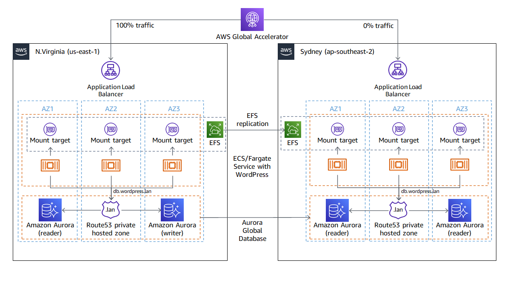

Good old WordPress! In fact, we picked WordPress to demonstrate some of our customers' pain - it's quite representative of a typical system our larger customers run: a) it requires a relational backend and a shared filesystem b) it lends itself nicely to containerisation. 

OK. We have deployed WordPress across two AWS regions: primary in N.Virginia (us-east-1) and a hot DR standby in Sydney (ap-southeast-2) running on [ECS/Fargate](https://docs.aws.amazon.com/AmazonECS/latest/userguide/what-is-fargate.html).

Fargate integrates nicely with [EFS](https://docs.aws.amazon.com/efs/index.html), and we use it as our shared filesystem to persist wordpress files, configs and user-uploaded content. For DR, we have enabled [EFS replication](https://docs.aws.amazon.com/efs/latest/ug/efs-replication.html) from N.Virginia to Sydney.

We use [Aurora Global Database](https://aws.amazon.com/rds/aurora/global-database/), replicating data from N.Virginia to Sydney. In order to ensure that WordPress configs match in both regions, we use [Route53 private hosted zones](https://docs.aws.amazon.com/Route53/latest/DeveloperGuide/hosted-zones-private.html) mapping unique regional Aurora endpoints to an internally resolveable `db.wordpress.lan`.

As you probably guessed, the secondary wordpress deployment in Sydney is essentially read-only since EFS and Aurora replicas are read-only.

Both primary and standby WordPress deployments are scaled out to 3 Fargate tasks in each region and sit behind two regional [Application Load Balancers](https://docs.aws.amazon.com/elasticloadbalancing/latest/application/introduction.html).

To ensure a single global point of entry, we use [Global Accelerator](https://aws.amazon.com/global-accelerator/?blogs-global-accelerator.sort-by=item.additionalFields.createdDate&blogs-global-accelerator.sort-order=desc&aws-global-accelerator-wn.sort-by=item.additionalFields.postDateTime&aws-global-accelerator-wn.sort-order=desc) on top of these two ALBs. Because under normal operation we don't want any traffic to go to the secondary read-only WordPress instance, the Global Accelerator endpoint routes 100% of traffic to the primary site in N.Virginia and 0% of traffic to the DR site in Sydney.

# Start Event
1. Go to https://dashboard.eventengine.run/ and enter the event hash provided by the organisers

    

2. Sign in as Amazon Employee

    

3. On Team Dashboard, click AWS Console. Make sure you're in N.Virginia

    

# Validate your environment
1. Go to the [N.Virginia Cloudformation console](https://us-east-1.console.aws.amazon.com/cloudformation/home?region=us-east-1#/stacks?filteringStatus=active&filteringText=&viewNested=true&hideStacks=false) and grab the outputs of the `lab-us-east-1` stack). These will be the Global Accelerator endpoint and the regional ALB endpoint for the primary deployment:

    

2. Repeat the same for Sydney - use the `lab-ap-southeast-2` stack. You'll get the same Global Accelerator endpoint and the regional ALB endpoint for the read-only hot standby deployment:

    

3. Open two browser windows using these two ALB endpoints. Try creating a comment under the "Welcome to Tech Summit 2022" post using the N.Virginia deployment and see how it propagates to the secondary Sydney deployment:

    

4. Try doing the same from the Sydney deployment and you'll get an error. It is expected - its Aurora database and EFS filesystem are read-only:

    

>If this isn't working as expected - there's an issue with your environment. Talk to one of the  facilitators before proceeding.

 If you know your way around WordPress, you can append `/wp-admin/` to the endpoint and log in using `admin` / `TechSummit2022` and create new posts.

# Task
Design and execute a fail-over from N.Virginia to Sydney. Clearly it involves a) failing over the Aurora Global Database to Sydney b) Failing over EFS replication to Sydney c) modifying the database endpoint in the secondary site and d) changing distribution weights in the Global Accelerator Endpoint and ... a few other things - I'll let you figure them out.

Oh yes, it all sounds great in theory, but this particular customer is ultra concerned that the last time they tried failing out of N.Virginia during the [December 2021 Event](https://aws.amazon.com/message/12721/), none of it worked. They cited that during the LSE, *'Route 53 APIs were impaired from 7:30 AM PST until 2:30 PM PST preventing customers from making changes to their DNS entries'* and this was partly the reason why they introduced Global Accelerator to the architecture.

Oh, and the customer's architect keeps repeating that they need to *'Rely on the data plane and not the control plane during recovery'*. You googled it and [discovered this is a new best practice](https://docs.aws.amazon.com/wellarchitected/latest/framework/a-failure-management.html#:~:text=Rely%20on%20the,it%20for%20recovery.) in the Reliability Pillar of the Well-Architected Framework. Go figure.

And one more thing - they want to know how they can do it without relying on the console as they could not access it during the December LSE :(.

# Solution
.

.

.

.

.

.

.

.

.

.

.

.

.

.

.

.

.

.

.

.

.

.

.

.

.

.

.

.

.

.

Have you actually tried finding a solution yourself?

.

.

.

.

.

.

.

.

.

.

.

.

.

.

.

.

.

.

.

.

.

.

.

.

.

.

.

.

.

.

.

.

.

.

.

.

you are persistent! 

.

.

.

.

.

.

.

.

.

.

.

.

.

.

.

.

.

.

okay, here we go.

.

.

.

.

.

.

.

.

.

.

.

.

.

.

.

.

.

.

.

.

.

.

.

.

.

.

.

.

.

.

(ok, I was joking just now. a bit more)

.

.

.

.

.

.

.

.

.

.

.

.

.

.

.

solution here

## Failing over Aurora
First of all, to reduce reliance on the AWS Control Plane for recovery we need to leverage health checks whenever possible. Route 53 Private Hosted Zone in Sydney is the first one we need to update. Go to the [Route53 Hosted Zones console](https://us-east-1.console.aws.amazon.com/route53/v2/hostedzones#) and locate the hosted zone for Sydney.

Currently we have a CNAME record for `db.wordpress.lan` that - if you look carefully - points to Aurora's read only endpoint in Sydney and uses a "Simple routing" policy.

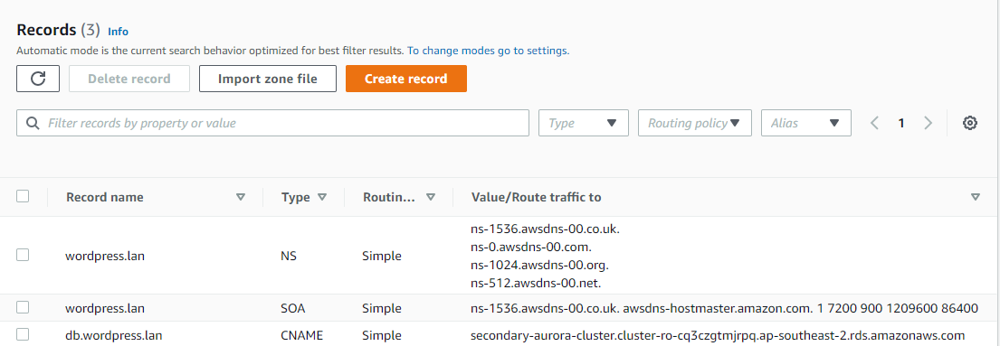

Why the read only endpoint? Let's go to [the RDS Console](https://ap-southeast-2.console.aws.amazon.com/rds/home?region=ap-southeast-2#database:id=secondary-aurora-cluster;is-cluster=true). Notice that the writer endpoint is inactive because Aurora in Sydney is a read-only 'mirror' of the Aurora in N.Virginia:

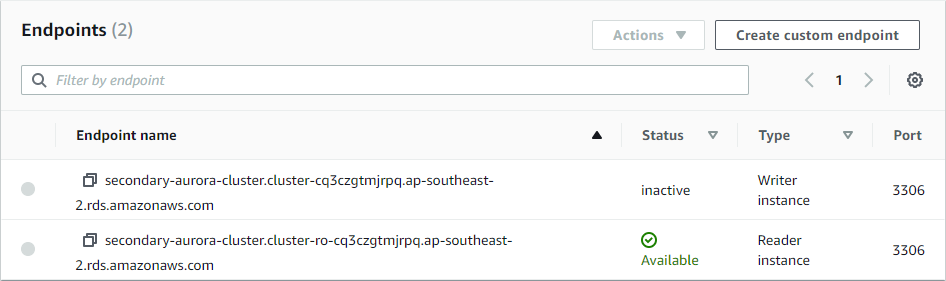

So, as part of our Aurora failover we need to repoint the `db.wordpress.lan` to the Aurora writer endpoint... but this is a control plane call. How do we avoid it? Let's see if we can wire in Route53 healthchecks to make it happen automatically. 

First, we need to create a CloudWatch alarm to be able to tell when the database is failed over to Sydney. With a threshold of EngineUptime <= 0 for role *WRITER* we will be able to reliably detect if we have writers in Sydney. Also specify 'Treat missing data as bad'.

Initially, the alarm will be active as there are no Aurora writers in Sydney:

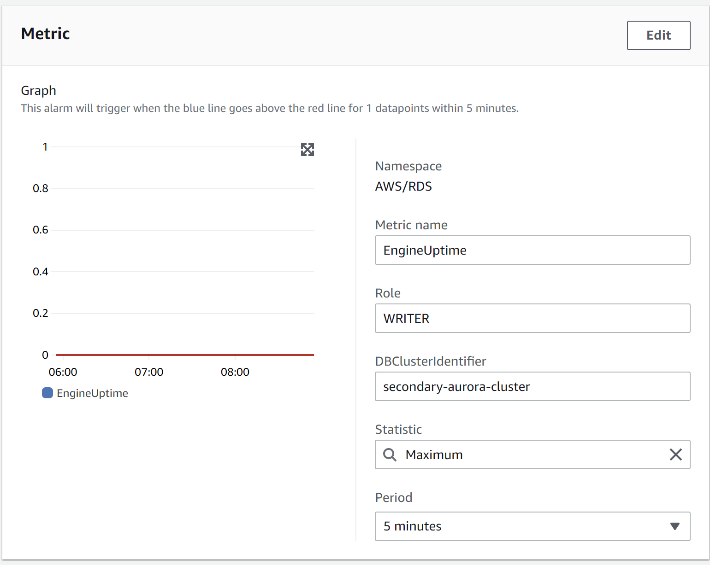
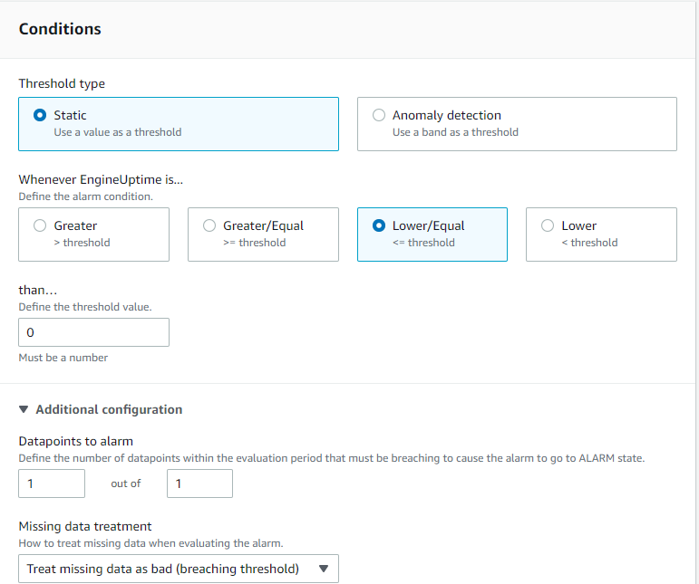

Now, let's create a Route53 healcheck. Go to the [Route53 Healthcheck console](https://us-east-1.console.aws.amazon.com/route53/healthchecks/home#/) and configure the Route53 healthcheck to use the CloudWatch alarm we've just created:

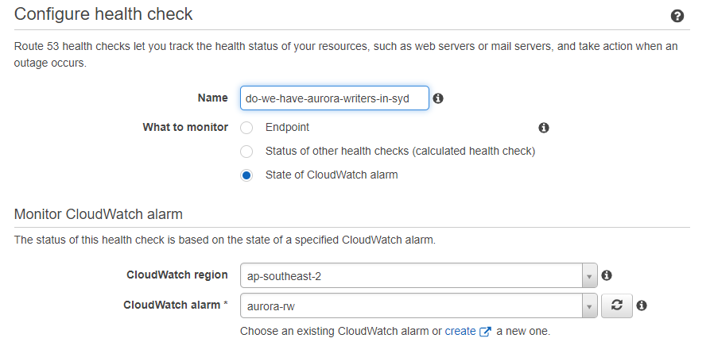

Now let's go back to Route53 and edit the existing record for `db.wordpress.lan`, making it a secondary record in a failover pair:

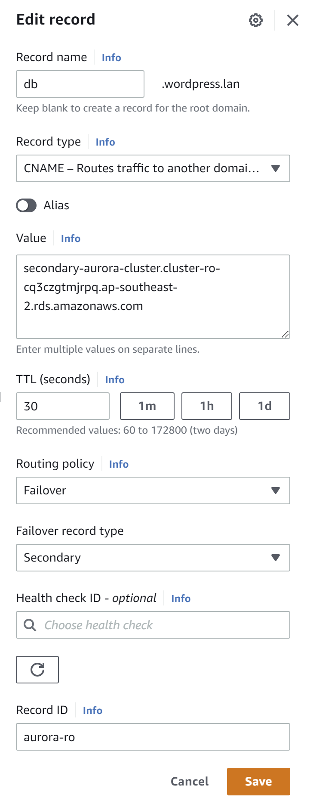

Let's add another record pointing to Aurora's inactive RW endpoint as the primary record in the Route53 failover pair, using the Route53 healcheck we just created:

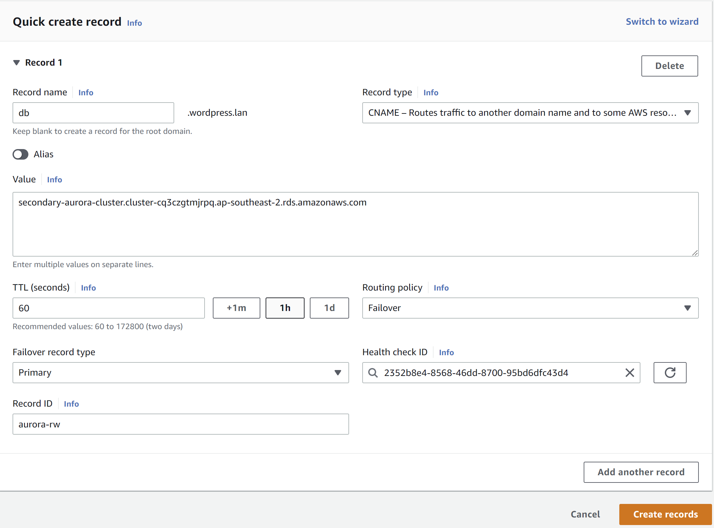

In the end, you will have something like this:

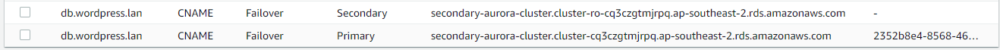 

What this gives us is the ability to rely on Route53 to automatically rewrite the `db.wordpress.lan` pointing it to Aurora's writer endpoint as soon as it becomes available in Sydney without involving any Route53 Control Plane calls.

Let's now failover Aurora to Sydney. Go to the [RDS Console](https://ap-southeast-2.console.aws.amazon.com/rds/home?region=ap-southeast-2#databases:), and initiate the failover to Sydney:

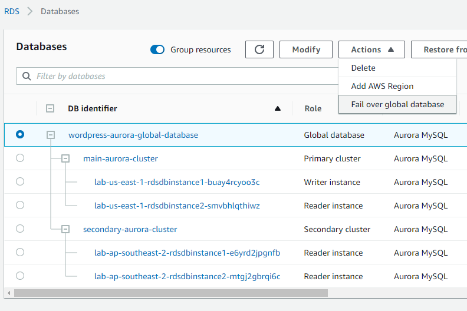.

> Keep in mind that in case there is Control Plane impairment in N.Virginia, you can simply remove the secondary cluster from the global cluster, achieving a similar outcome

In a few minutes you should see the cloudwatch alarm and the Route53 healthcheck go healthy and `db.wordpress.lan` will be repointed to the Aurora writer endpoint in Sydney.

Test out your wordpress endpoints.

Which ones work?

Is there anything else that should be changed to allow testing of the other site before failback?

## Failing over EFS
Now, remember - EFS is replicated from N.Virginia to Sydney (where it's read-only). In order to make it writeable we simply need to break the replication. [Go to the EFS Console in Sydney](https://ap-southeast-2.console.aws.amazon.com/efs/home?region=ap-southeast-2#/file-systems) and click on the EFS file system. Notice the following warning:

Delete the replication by going to the Replication tab and clicking 'Delete replication':

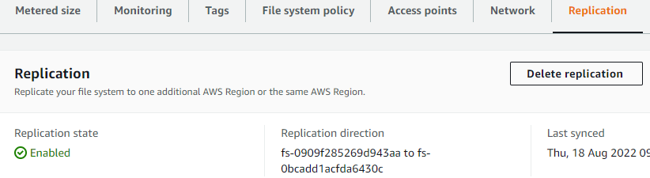

### Extension:

* How would you automate this, such that it occurs at the same time as the Route53 failover?
* Which regions would you run this automation in?
* Implementation this automation.
* How would you implement the fail-back of EFS after the DR event?

## Failing over Global Accelerator (GA)
Go to the [GA Console](https://us-west-2.console.aws.amazon.com/globalaccelerator/home?region=ap-southeast-2#GlobalAcceleratorDashboard:) and click on the Global Accelerator. Scroll down and click on the listener:

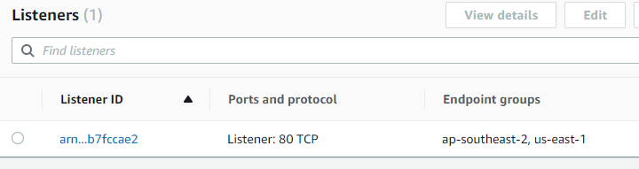

Adjust the weights so that Sydney receives 100% of all traffic:

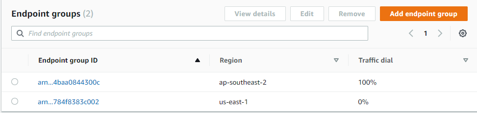

Test using the GA endpoint and the two regional ALB endpoints.

By the way, can you guess why the N.Virginia instance is returning an error now?

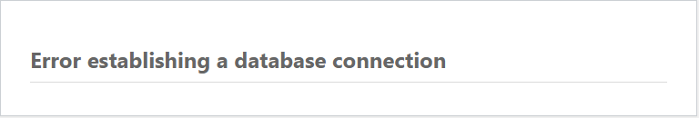

## Conclusion

We still had to make a few control plane calls - for example, Aurora failover was one and EFS delete mirror was another. What's important here is that they were all run out of the Sydney region. We completely avoided having dependency on the global control plane of Route53 or on the N.Virginia region we're failing out of.

Of course, we click-ops'ed our way through it.

Before you finish - write down your answers to the following and email to your facilitator:
* How would you go about automating it - and which region will you run this automation out of?
* How would you recover back to the primary region with minimal risk? Will this happen automatically, or with a manual trigger?
* What playbooks are required?
* What sections & questions in the Well Architected Review have we covered in this exercise?

Thanks for your time!
