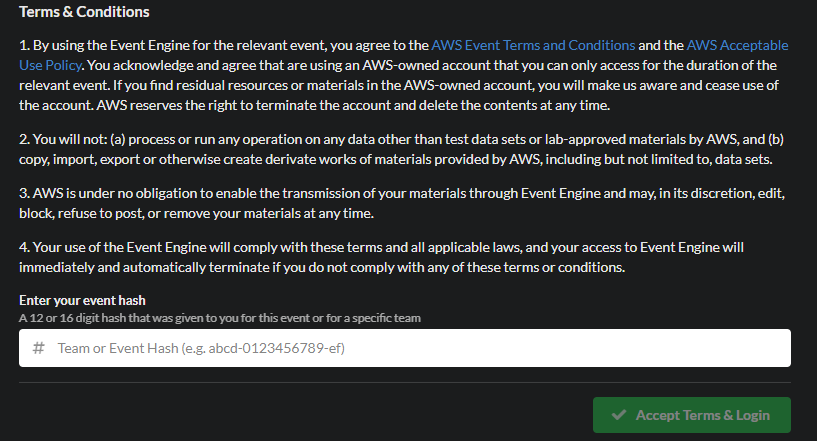
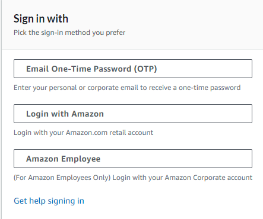
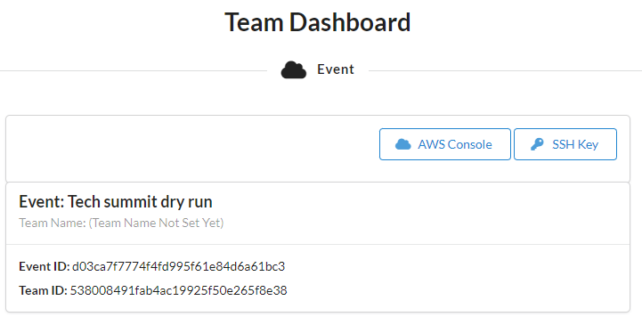
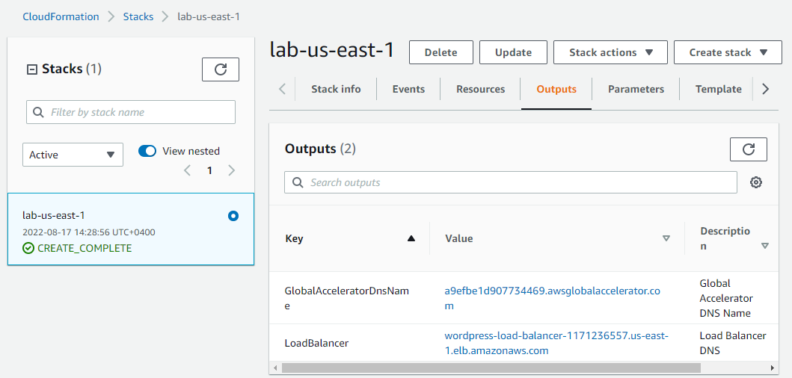
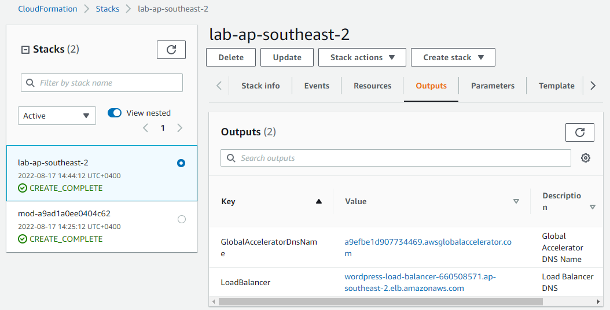
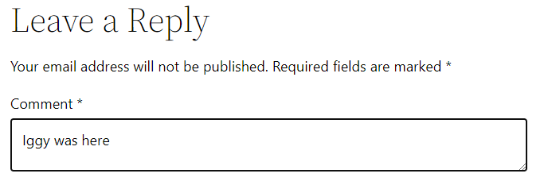
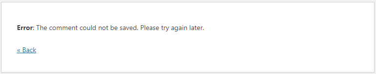

# aws-tech-summit-lab
> AWS Tech Summit 2022 lab demostrating some concepts of multi-region recovery, minimising reliance on the control plane for recovery.

As the criticality of workloads our customers deploy to AWS increases, it's not uncommon to see multi-region deployments in order to achieve extreme reliability targers for critical workloads (think nationally critical infrastructure, payment systems, emergency response, etc). 

These workloads will rarely be deployed active-active across two AWS regions - far from every system can tolerate the latency and eventual consistency; the majority of multi-region deployments  follow a more traditional DR set of ideas. Yet we see customers misdesigning their approach to cross-region disaster recovery, especially - and you will see this from today's lab - if it involves complex choreography across multiple services. 

# What have we deployed

> INSERT DIAGRAM HERE

Good old WordPress! In fact, we picked WordPress to demonstrate some of our customers' pain - it's quite representative of the typical systems our larger customers are dealing with: a) it requires a relational backend and a shared filesystem b) it lends itself nicely to containerisation. 

OK. We have deployed WordPress across two AWS regions: us-east-1 (primary) and ap-southeast-2 (read-only hot standby) running on [ECS/Fargate](https://docs.aws.amazon.com/AmazonECS/latest/userguide/what-is-fargate.html).

Fargate integrates nicely with [EFS](https://docs.aws.amazon.com/efs/index.html), and we use it as our shared filesystem to persist wordpress binaries, configs and user-uploaded content. For DR, we have enabled [EFS replication](https://docs.aws.amazon.com/efs/latest/ug/efs-replication.html) from us-east-1 to ap-southeast-2.

We use [Aurora Global Database](https://aws.amazon.com/rds/aurora/global-database/), replicating data from us-east-1 to ap-southeast-2. In order to ensure that WordPress configs in both regions, we use [Route53 private hosted zones](https://docs.aws.amazon.com/Route53/latest/DeveloperGuide/hosted-zones-private.html) mapping regional Aurora endpoints to an internally resolveable `db.wordpress.lan`.

As you probably guessed, the secondary wordpress deployment in ap-southeast-2 is essentially read-only since EFS and Aurora replicas are read-only.

Both primary and standby WprdPress deployments are scaled out to 3 Fargate tasks in each region and sit behind two regional [Application Load Balancers](https://docs.aws.amazon.com/elasticloadbalancing/latest/application/introduction.html).

To ensure a single global point of entry, we use [Global Accelerator](https://aws.amazon.com/global-accelerator/?blogs-global-accelerator.sort-by=item.additionalFields.createdDate&blogs-global-accelerator.sort-order=desc&aws-global-accelerator-wn.sort-by=item.additionalFields.postDateTime&aws-global-accelerator-wn.sort-order=desc) on top of these two ALBs. Because we don't want traffic to go to the secondary read-only WordPress instance, the Global Accelerator endpoint routes 100% of traffic to the primary site in us-east-1 and 0% of traffic to the secondary site.

# Start Event
1. Go to https://dashboard.eventengine.run/ and enter the event hash provided by the organisers
    

2. Sign in as Amazon Employee
    

3. On Team Dashboard, click AWS Console. Make sure you're in us-east-1
    

# Validate your environment
1. Go to the [us-east-1 Cloudformation console](https://us-east-1.console.aws.amazon.com/cloudformation/home?region=us-east-1#/stacks?filteringStatus=active&filteringText=&viewNested=true&hideStacks=false) and grab the outputs of the `lab-us-east-1` stack). These will be the Global Accelerator endpoint and the regional ALB endpoint for the primary deployment:
    

2. Repeat the same for ap-southeast-2 - use the `lab-ap-southeast-2` stack. You'll get the same Global Accelerator endpoint and the regional ALB endpoint for the read-only hot standby deployment:
    

3. Open two browser windows using the ALB endpoints. Try creating a comment under the "Welcome to Tech Summit 2022" post using the us-east-1 deployment and see how it propagates to the secondary ap-southeast-2 deployment:
    

4. Try doing the same from the secondary deployment and you'll get an error as its database and filesystem are read-only:
    

>If this isn't working as expected - there's an issue with your environment. Talk to a facilitator before proceeding.

 If you know your way around WordPress, you can append `/wp-admin/` to the endpoint and log in using `admin` / `TechSummit2022` and create new posts.

# Goal
Looking at this environment, design and execute a fail-over.Clearly it involves a) failing over the Aurora Global Database to ap-southeast-2 b) Failing over EFS replication to ap-southeast-2 c) modifying the database endpoint in the secondary site and d) changing distribution weights in the Global Accelerator Endpoint and ... a few other things - I'll let you figure them out.

Oh yes, it all sounds great in theory, but this particular customer is ultra concerned that the last time they tried failing out of us-east-1 during the [December 2021 Event](https://aws.amazon.com/message/12721/), none of it worked. They cited that during the LSE, *'Route 53 APIs were impaired from 7:30 AM PST until 2:30 PM PST preventing customers from making changes to their DNS entries'* and this was partly the reason why they introduced Global Accelerator to the architecture since December.

Oh, and the customer's architect keeps repeating that they need to *'Rely on the data plane and not the control plane during recovery'*. You googled it and [discovered this is a new best practice](https://docs.aws.amazon.com/wellarchitected/latest/framework/a-failure-management.html#:~:text=Rely%20on%20the,it%20for%20recovery.) in the Reliability Pillar of the Well-Architected Framework. Go figure.